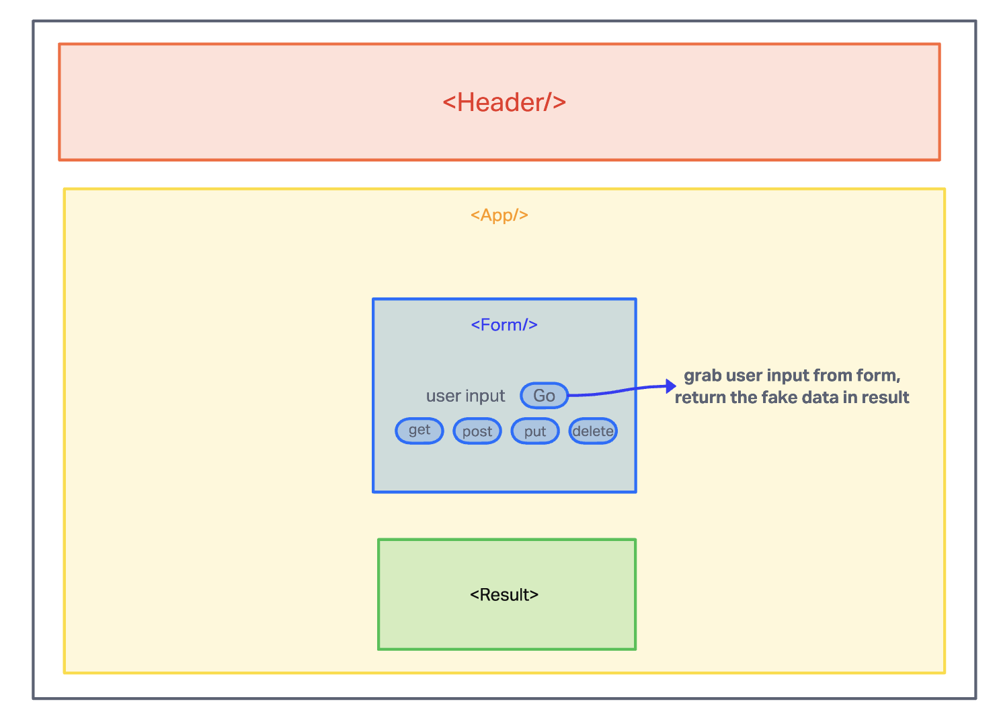

# LAB - Class 27

## Project: RESTy

### Author: Brenda Jow

### Problem Domain  

- Our application will be an API testing tool that can be run in any browser, allowing a user to easily interact with APIs in a familiar interface.

- convert `<App/>` from classes to functional componenet.
- use `useState()` hook in functional componenets to properly manage state.
- render result summary after user submit form.
- adding SCSS.

### Links and Resources

- [GitHub Actions ci/cd](https://github.com/brenda70904/resty/actions)
- [front-end application](http://xyz.com) (when applicable)

### Setup

#### `.env` requirements (where applicable)

not require

#### How to initialize/run your application (where applicable)

`npm start`
<!-- 
#### How to use your library (where applicable)

#### Features / Routes

- Feature One: Details of feature
- GET : `/hello` - specific route to hit -->

#### Tests

- How do you run tests?
  - `npm test a`
- Any tests of note?
- Describe any tests that you did not complete, skipped, etc
  - don't have test for `<App/>`

#### UML

